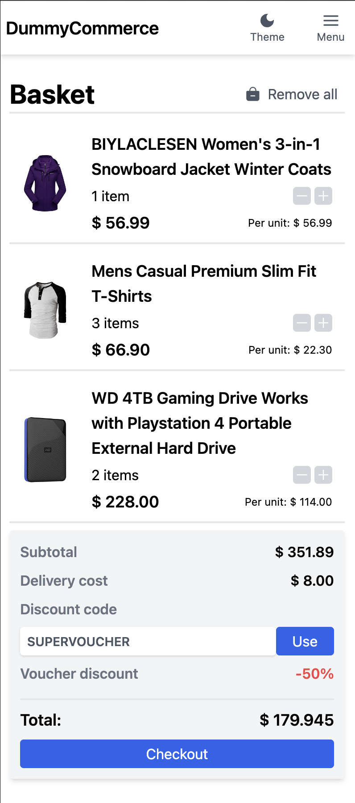
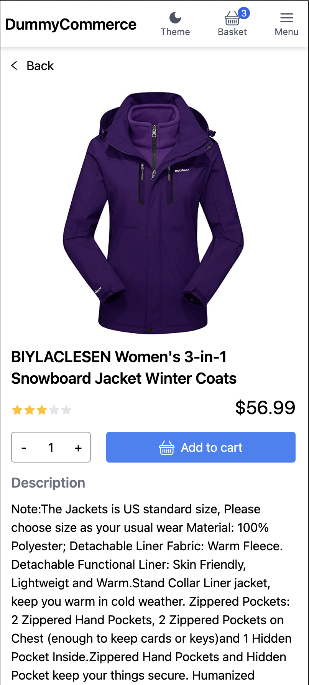

## DummyCommerce

An e-commerce website created with <a href="https://fakestoreapi.com/">FakeStore API</a> to practice acquired skills on a project you may encounter at work.

## Stack:

        

## Project Status

This project is currently in development. Users can browse products divided into categories, add them to cart and mange quantity of products in cart. The cart is saved to local storage

## Project Screen Shots 

     

## Installation and Setup Instructions

Clone down this repository. You will need `node` and `npm` installed globally on your machine.

Installation:

`npm install`

To Start Server:

`npm run dev`

To Visit App (by default):

`localhost:5137`

